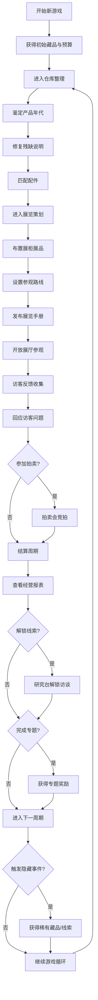

# 产品考古馆 - 产品需求文档 (PRD)

## 1. 产品概述

玩家扮演博物馆策展人，负责整理一家虚构科技公司「星河科技」的历史产品展览。通过鉴定、修复、策划、拍卖等玩法，打造高评分的科技产品历史展。

- 核心玩法：经营模拟 + 策略策划 + 收藏解谜
- 目标用户：喜欢经营模拟、历史收藏、策略游戏的桌面玩家
- 产品价值：沉浸式体验科技产品历史演变的乐趣，结合决策策略与收集成就感

## 2. 核心功能

### 2.1 用户角色

| 角色 | 描述 | 核心能力 |
|------|------|----------|
| 策展人（玩家） | 博物馆新任命的策展人 | 管理仓库、策划展览、参加拍卖、回应访客 |

### 2.2 功能模块（7大模块）

1. **展厅地图**：可视化展览布局，管理展柜位置，设置参观路线
2. **仓库整理**：管理藏品库存，鉴定产品年代，修复残缺说明，匹配配件
3. **访客反馈**：查看访客评论，回应访客问题，收集口碑评价
4. **研究台**：解锁访谈线索，完成专题任务，比较竞品历史
5. **拍卖会**：参加竞拍获得稀世藏品，控制预算支出
6. **展览策划**：布置展柜展品，设置参观路线，发布展览手册
7. **结算面板**：查看经营报表，馆藏评分，触发隐藏事件，结算周期收益

### 2.3 页面详情

| 页面名称 | 模块名称 | 功能描述 |
|----------|----------|----------|
| 主界面 | 顶部导航栏 | 显示预算、馆藏评分、周期、模块切换 |
| 主界面 | 侧边状态栏 | 当前展览状态、访客数量、口碑指数 |
| 展厅地图 | 楼层平面图 | 4个展厅区域、可拖动展柜、参观路线绘制 |
| 展厅地图 | 展柜管理 | 展柜等级、展品信息、灯光/背景配置 |
| 仓库整理 | 藏品列表 | 分类筛选、年代排序、稀有度标记 |
| 仓库整理 | 鉴定工作台 | 产品年代判定、真伪鉴别、评分系统 |
| 仓库整理 | 修复台 | 说明补全、配件匹配、还原度提升 |
| 访客反馈 | 访客留言板 | 实时评论流、问题分类、满意度指标 |
| 访客反馈 | 问答系统 | 访客提问匹配、知识库回答、奖励机制 |
| 研究台 | 线索墙 | 访谈记录、历史档案、关联图谱 |
| 研究台 | 专题任务 | 任务列表、进度追踪、奖励解锁 |
| 研究台 | 竞品对比 | 时间轴对比、技术参数对比、市场表现 |
| 拍卖会 | 拍品展示 | 预展拍品、起拍价、稀有度、来源 |
| 拍卖会 | 竞价系统 | 实时叫价、预算限制、AI对手竞价 |
| 展览策划 | 主题选择 | 展览主题、时间跨度、目标受众设定 |
| 展览策划 | 展品布置 | 拖拽搭配、展柜分配、叙事逻辑编排 |
| 展览策划 | 手册发布 | 手册编辑、封面设计、宣传效果 |
| 结算面板 | 经营报表 | 收入支出、访客统计、口碑趋势 |
| 结算面板 | 馆藏评分 | 综合评分、分类评分、排行榜位置 |
| 结算面板 | 事件日志 | 隐藏事件触发、特殊成就、历史记录 |

## 3. 核心流程

### 3.1 游戏主循环

玩家在每个周期（回合）内可以执行多种操作，当选择「结算」时进入下一个周期，系统根据展览效果计算收益和事件。

### 3.2 核心流程图

### 3.3 核心玩法规则

- **藏品评分**：由年代准确度、说明完整度、配件匹配度、稀有度四部分组成
- **馆藏评分**：所有展出藏品评分加权 + 展览主题契合度 + 路线设计评分
- **口碑系统**：访客满意度 × 访客数量 × 媒体评分
- **预算管理**：拍卖支出、修复费用、宣传费用需在预算内
- **隐藏事件**：特定藏品组合 + 特定访谈线索 + 随机概率触发

## 4. 用户界面设计

### 4.1 设计风格

**复古未来主义 (Retro-Futurism)** — 融合80-90年代科技产品的怀旧感与博物馆的典雅气质。

- **主色调**：
  - 深墨绿 `#1a3c34`（博物馆墙壁的沉稳感）
  - 古铜金 `#c9a85c`（铭牌、画框的金属感）
  - 暖米白 `#f5f0e1`（展墙背景的纸质感）
  - 警示橙 `#e07856`（重要提示、稀有标记）
  
- **辅助色**：
  - 深棕 `#4a3728`（木质展柜）
  - 灰蓝 `#6b8a9e`（电子屏幕冷光）
  - 暗红 `#8b3a3a`（印章、封蜡色）

- **按钮风格**：微浮雕效果，圆角8px，悬停时古铜金边发光
- **字体**：
  - 标题：「思源宋体」/ Noto Serif SC（衬线体，博物馆气质）
  - 正文：「思源黑体」/ Noto Sans SC（清晰易读）
  - 数字/标签：「JetBrains Mono」等宽字体（科技感）
- **布局风格**：多层卡片堆叠 + 羊皮纸纹理背景 + 细微噪点颗粒感
- **图标风格**：线性图标 + 古铜色描边，重要物品配微发光效果

### 4.2 页面设计概览

| 页面名称 | 模块名称 | UI元素 |
|----------|----------|--------|
| 主界面 | 顶部导航 | 深墨绿底 + 古铜金分割线，模块图标带悬停动效 |
| 展厅地图 | 平面图 | 俯视视角，展柜为立体卡片，路线用虚线动画连接 |
| 仓库整理 | 藏品架 | 木质格子架设计，藏品卡片带轻微倾斜与投影 |
| 仓库整理 | 鉴定台 | 放大镜悬浮效果，扫描光线动画 |
| 访客反馈 | 留言板 | 便利贴样式排列，不同颜色代表不同情绪 |
| 研究台 | 线索墙 | 软木板 + 图钉 + 红线连接，模拟侦探墙效果 |
| 拍卖会 | 拍卖厅 | 木质拍卖台，竞价数字跳动动画，倒计时进度条 |
| 展览策划 | 策划板 | 时间轴布局 + 拖拽区域，主题色晕染背景 |
| 结算面板 | 数据大屏 | 仪表盘式图表，金色描边的统计卡片 |

### 4.3 响应式设计

- **桌面优先**：主要针对 1280px+ 宽度设计，最大内容宽度 1600px
- **平板适配**：侧边栏收起为图标式，模块切换改为底部Tab
- **触控优化**：按钮最小触控区域 44×44px，拖拽操作增加触控反馈

### 4.4 动画与交互细节

- **页面切换**：模块切换时使用卡片翻转 + 渐入效果
- **藏品卡片**：悬停时上浮 4px + 古铜金光晕扩散
- **鉴定动画**：环形扫描线从中心扩散，年代数字逐位跳动
- **拍卖竞价**：数字变化时使用等宽字体位滚动效果
- **满意度变化**：口碑指数变化时带数字滚动 + 趋势小箭头
- **隐藏事件**：全屏轻微震动 + 暗红色边框脉冲 + 特殊音效提示
