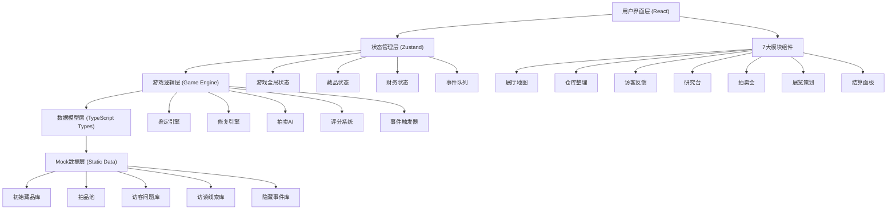
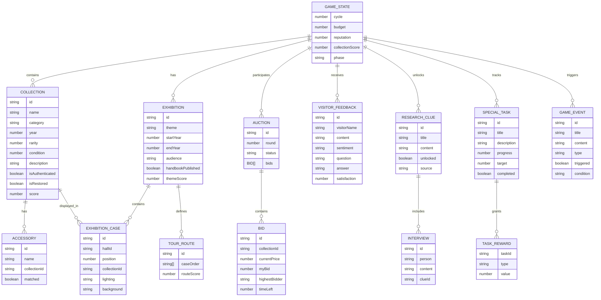

# 产品考古馆 - 技术架构文档

## 1. 架构设计



## 2. 技术描述

- **前端框架**：React@18 + TypeScript
- **构建工具**：Vite@5
- **样式方案**：Tailwind CSS@3 + CSS Variables
- **状态管理**：Zustand@4
- **路由方案**：React Router DOM@6（单页应用，使用Hash路由）
- **图标库**：Lucide React
- **数据方案**：静态Mock数据（纯前端，无后端）
- **初始化模板**：react-ts (Vite + React + TypeScript + Tailwind + Zustand)

## 3. 路由定义

| 路由 | 页面/模块 | 用途 |
|------|-----------|------|
| `/` | 主界面布局 | 包含顶部导航和7个模块切换容器 |
| `/hall` | 展厅地图 | 可视化展览布局与展柜管理 |
| `/warehouse` | 仓库整理 | 藏品管理、鉴定、修复工作台 |
| `/visitors` | 访客反馈 | 访客留言板与问答系统 |
| `/research` | 研究台 | 线索墙、专题任务、竞品对比 |
| `/auction` | 拍卖会 | 拍品展示与竞价系统 |
| `/planning` | 展览策划 | 主题选择、展品布置、手册发布 |
| `/settlement` | 结算面板 | 经营报表、馆藏评分、事件日志 |

## 4. 数据模型

### 4.1 数据模型ER图



### 4.2 核心数据类型定义

```typescript
// 游戏核心状态
interface GameState {
  cycle: number;              // 当前周期（回合数）
  phase: 'planning' | 'exhibition' | 'settlement';
  budget: number;             // 预算余额
  reputation: number;         // 口碑指数 0-100
  collectionScore: number;    // 馆藏评分 0-1000
  totalVisitors: number;      // 累计访客数
  income: number;             // 本周期收入
  expenses: number;           // 本周期支出
}

// 藏品类型
type Category = 'computer' | 'phone' | 'audio' | 'tv' | 'game' | 'other';
type Rarity = 'common' | 'uncommon' | 'rare' | 'epic' | 'legendary';

interface CollectionItem {
  id: string;
  name: string;
  category: Category;
  categoryName: string;
  estimatedYear: number | null;   // 玩家估计的年代
  actualYear: number;             // 真实年代（鉴定后显示）
  rarity: Rarity;
  rarityName: string;
  condition: number;              // 品相 0-100
  description: string;            // 完整说明
  partialDescription: string;     // 残缺说明（修复前可见）
  isAuthenticated: boolean;       // 是否已鉴定
  isRestored: boolean;            // 是否已修复
  accessories: Accessory[];       // 配件列表
  accessoriesMatched: number;     // 已匹配配件数
  accessoriesTotal: number;       // 总配件数
  image: string;                  // 藏品图片（emoji或图标）
  color: string;                  // 藏品主题色
  score: number;                  // 综合评分 0-100
  location: 'warehouse' | 'exhibition' | 'auction';
  exhibitionCaseId?: string;      // 所在展柜ID
  source: string;                 // 藏品来源
}

interface Accessory {
  id: string;
  name: string;
  icon: string;
  matched: boolean;
  description: string;
}

// 展厅与展柜
interface Hall {
  id: string;
  name: string;
  description: string;
  color: string;
  cases: ExhibitionCase[];
}

interface ExhibitionCase {
  id: string;
  hallId: string;
  name: string;
  position: { x: number; y: number };
  level: 1 | 2 | 3;
  collectionId: string | null;
  lighting: 'warm' | 'cool' | 'spotlight' | 'neon';
  background: 'plain' | 'gradient' | 'vintage' | 'futuristic';
  unlocked: boolean;
}

// 访客反馈
interface VisitorFeedback {
  id: string;
  visitorName: string;
  avatar: string;
  type: 'comment' | 'question';
  content: string;
  sentiment: 'positive' | 'neutral' | 'negative';
  questionCategory?: 'history' | 'tech' | 'price' | 'other';
  answer?: string;
  answered?: boolean;
  satisfaction: number;
  timestamp: number;
  cycle: number;
}

// 研究线索与访谈
interface ResearchClue {
  id: string;
  title: string;
  content: string;
  unlocked: boolean;
  unlockCondition: string;
  requiredReputation?: number;
  requiredCycle?: number;
  relatedCollectionIds?: string[];
  interviews: Interview[];
  connections: string[];       // 关联的其他线索ID
}

interface Interview {
  id: string;
  person: string;
  role: string;
  avatar: string;
  content: string;
  unlocked: boolean;
}

// 专题任务
interface SpecialTask {
  id: string;
  title: string;
  description: string;
  icon: string;
  category: 'collection' | 'exhibition' | 'research' | 'reputation';
  progress: number;
  target: number;
  completed: boolean;
  claimed: boolean;
  reward: {
    type: 'budget' | 'reputation' | 'collection' | 'clue';
    value: number | string;
    label: string;
  };
}

// 竞品对比
interface CompetitorProduct {
  id: string;
  name: string;
  company: string;
  year: number;
  category: Category;
  image: string;
  specs: { label: string; value: string; advantage: boolean }[];
  marketShare: number;
  price: number;
}

// 拍卖会
interface AuctionItem {
  id: string;
  collection: CollectionItem;
  startPrice: number;
  currentPrice: number;
  myBid: number;
  highestBidder: string;
  isLeading: boolean;
  timeLeft: number;         // 剩余时间（回合单位）
  status: 'upcoming' | 'active' | 'ended' | 'won' | 'lost';
  opponents: AuctionOpponent[];
}

interface AuctionOpponent {
  id: string;
  name: string;
  avatar: string;
  style: 'aggressive' | 'conservative' | 'random';
  budget: number;
}

// 展览策划
interface ExhibitionPlan {
  id: string;
  theme: string;
  themeDescription: string;
  startYear: number;
  endYear: number;
  targetAudience: 'general' | 'enthusiast' | 'expert' | 'students';
  audienceName: string;
  handbookTitle: string;
  handbookCover: string;
  handbookPublished: boolean;
  brochureCount: number;
  routeDesignScore: number;
  themeFitScore: number;
  overallScore: number;
}

// 参观路线
interface TourRoute {
  id: string;
  caseOrder: string[];          // 展柜ID顺序
  startTime: string;
  estimatedDuration: number;    // 分钟
  highlights: string[];         // 重点展品ID
  score: number;
}

// 游戏事件
interface GameEvent {
  id: string;
  title: string;
  description: string;
  type: 'hidden' | 'random' | 'milestone' | 'achievement';
  icon: string;
  triggered: boolean;
  triggerCycle?: number;
  condition: {
    minScore?: number;
    minReputation?: number;
    requiredCollections?: string[];
    requiredClues?: string[];
    randomChance?: number;
  };
  reward?: {
    type: 'budget' | 'reputation' | 'collection' | 'clue';
    value: number | string;
  };
  cycle: number;                // 触发时的周期
}

// 经营报表数据
interface FinancialReport {
  cycle: number;
  income: {
    ticketSales: number;
    merchandise: number;
    donations: number;
    sponsorship: number;
  };
  expenses: {
    auctionPurchases: number;
    restoration: number;
    marketing: number;
    maintenance: number;
  };
  visitorStats: {
    total: number;
    byAudience: Record<string, number>;
    satisfaction: number;
  };
  scoreBreakdown: {
    authenticity: number;
    completeness: number;
    rarity: number;
    presentation: number;
    narrative: number;
  };
}
```

## 5. 项目目录结构

```
d:\TraeProjects\1068/
├── .trae/documents/              # 项目文档
│   ├── PRD-产品考古馆.md
│   └── 技术架构文档.md
├── public/                       # 静态资源
├── src/
│   ├── assets/                   # 图片、样式资源
│   ├── components/               # 公共组件
│   │   ├── layout/              # 布局组件
│   │   │   ├── Header.tsx       # 顶部导航栏
│   │   │   ├── Sidebar.tsx      # 侧边状态栏
│   │   │   └── ModuleTabs.tsx   # 模块切换标签
│   │   ├── collection/          # 藏品相关组件
│   │   │   ├── CollectionCard.tsx
│   │   │   ├── CollectionDetail.tsx
│   │   │   └── RarityBadge.tsx
│   │   └── ui/                  # 基础UI组件
│   │       ├── Button.tsx
│   │       ├── Card.tsx
│   │       ├── ProgressBar.tsx
│   │       ├── StatCard.tsx
│   │       └── Modal.tsx
│   ├── data/                     # Mock数据
│   │   ├── collections.ts       # 初始藏品库
│   │   ├── accessories.ts       # 配件库
│   │   ├── visitors.ts          # 访客问题与评论库
│   │   ├── clues.ts             # 研究线索与访谈
│   │   ├── auctions.ts          # 拍品池与AI对手
│   │   ├── tasks.ts             # 专题任务库
│   │   ├── competitors.ts       # 竞品数据
│   │   ├── events.ts            # 隐藏事件库
│   │   └── halls.ts             # 展厅与展柜配置
│   ├── hooks/                    # 自定义Hooks
│   │   ├── useGameEngine.ts     # 游戏引擎Hook
│   │   ├── useAuthentication.ts # 鉴定逻辑Hook
│   │   ├── useRestoration.ts    # 修复逻辑Hook
│   │   └── useAuctionAI.ts      # 拍卖AI Hook
│   ├── pages/                    # 页面模块
│   │   ├── HallMap.tsx          # 展厅地图
│   │   ├── Warehouse.tsx        # 仓库整理
│   │   ├── Visitors.tsx         # 访客反馈
│   │   ├── Research.tsx         # 研究台
│   │   ├── Auction.tsx          # 拍卖会
│   │   ├── Planning.tsx         # 展览策划
│   │   └── Settlement.tsx       # 结算面板
│   ├── store/                    # 状态管理
│   │   ├── useGameStore.ts      # 游戏全局状态
│   │   └── useUIModalStore.ts   # UI弹层状态
│   ├── types/                    # TypeScript类型定义
│   │   ├── game.ts
│   │   ├── collection.ts
│   │   └── index.ts
│   ├── utils/                    # 工具函数
│   │   ├── scoreCalculator.ts   # 评分计算
│   │   ├── eventTrigger.ts      # 事件触发检测
│   │   ├── formatters.ts        # 数字/文本格式化
│   │   └── randomGenerator.ts   # 随机数生成器
│   ├── App.tsx
│   ├── main.tsx
│   └── index.css
├── index.html
├── package.json
├── vite.config.ts
├── tsconfig.json
├── tailwind.config.js
└── postcss.config.js
```

## 6. 核心算法说明

### 6.1 藏品评分算法

```typescript
function calculateCollectionScore(item: CollectionItem): number {
  // 年代准确度（鉴定成功获得）
  const authenticityScore = item.isAuthenticated 
    ? Math.max(0, 100 - Math.abs(item.estimatedYear! - item.actualYear) * 5)
    : 20;
    
  // 说明完整度（修复成功获得）
  const completenessScore = item.isRestored ? 100 : 
    (item.partialDescription.length / item.description.length) * 60 + 20;
    
  // 配件匹配度
  const accessoryScore = item.accessoriesTotal > 0
    ? (item.accessoriesMatched / item.accessoriesTotal) * 100
    : 80;  // 无配件默认80分
    
  // 稀有度加成
  const rarityBonus: Record<Rarity, number> = {
    common: 0, uncommon: 10, rare: 20, epic: 35, legendary: 50
  };
  
  // 品相成色
  const conditionScore = item.condition;
  
  // 加权平均
  const baseScore = (
    authenticityScore * 0.25 +
    completenessScore * 0.25 +
    accessoryScore * 0.20 +
    conditionScore * 0.15 +
    rarityBonus[item.rarity] * 0.15
  );
  
  return Math.min(100, Math.round(baseScore));
}
```

### 6.2 馆藏评分算法

```typescript
function calculateCollectionScore(state: GameState, items: CollectionItem[], plan: ExhibitionPlan): number {
  // 展出藏品平均分
  const displayedItems = items.filter(i => i.location === 'exhibition');
  const avgItemScore = displayedItems.length > 0
    ? displayedItems.reduce((sum, i) => sum + i.score, 0) / displayedItems.length
    : 0;
    
  // 展览主题契合度
  const themeFitScore = calculateThemeFit(displayedItems, plan);
  
  // 参观路线评分
  const routeScore = plan.routeDesignScore || 50;
  
  // 稀有展品加成
  const rarityBonus = displayedItems
    .filter(i => i.rarity === 'epic' || i.rarity === 'legendary').length * 20;
    
  // 综合评分 (满分1000)
  return Math.round(
    avgItemScore * 5 +
    themeFitScore * 2 +
    routeScore * 1.5 +
    rarityBonus +
    state.reputation * 0.5
  );
}
```

### 6.3 拍卖AI竞价策略

```typescript
// 三种AI竞价风格
// aggressive: 激进，最高出到估价150%
// conservative: 保守，最高出到估价80%
// random: 随机，估价50%-120%
function generateAIBid(opponent: AuctionOpponent, itemValue: number, currentPrice: number): number | null {
  const maxBid = {
    aggressive: itemValue * 1.5,
    conservative: itemValue * 0.8,
    random: itemValue * (0.5 + Math.random() * 0.7)
  }[opponent.style];
  
  if (currentPrice >= maxBid) return null;  // 放弃竞价
  
  // 加价幅度
  const increment = Math.max(
    Math.floor(itemValue * (0.02 + Math.random() * 0.05)),
    100
  );
  
  return Math.min(currentPrice + increment, Math.floor(maxBid));
}
```

### 6.4 隐藏事件触发检测

```typescript
function checkHiddenEvent(event: GameEvent, state: GameState, items: CollectionItem[], clues: ResearchClue[]): boolean {
  const c = event.condition;
  
  if (c.minScore && state.collectionScore < c.minScore) return false;
  if (c.minReputation && state.reputation < c.minReputation) return false;
  
  if (c.requiredCollections) {
    const ownedIds = items.filter(i => i.location !== 'auction').map(i => i.id);
    if (!c.requiredCollections.every(id => ownedIds.includes(id))) return false;
  }
  
  if (c.requiredClues) {
    const unlockedClueIds = clues.filter(c => c.unlocked).map(c => c.id);
    if (!c.requiredClues.every(id => unlockedClueIds.includes(id))) return false;
  }
  
  if (c.randomChance && Math.random() > c.randomChance) return false;
  
  return true;
}
```
